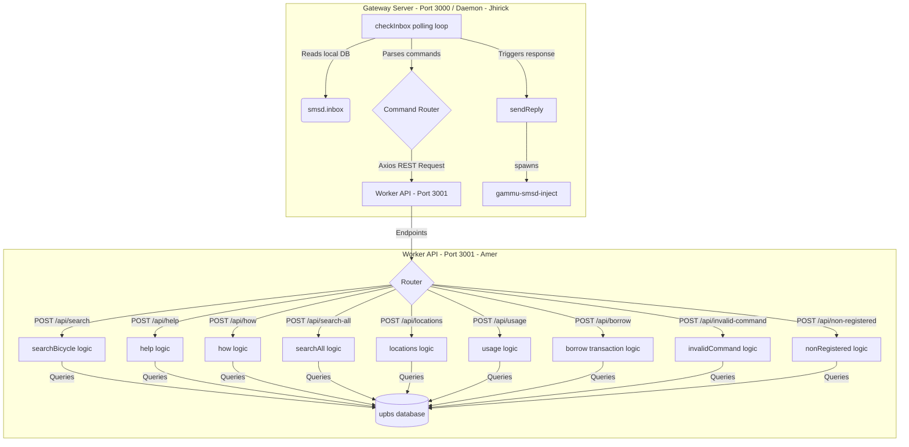

# Monorepo Integration & Merging Plan

This document explains how the **Gateway Server** (Developer B - Jhirick) and the **Worker API** (Developer A - Amer) interact, how to run them, and how they will merge and deploy in the production environment.

---

## 1. Interaction Diagram

The Gateway Server acts as the front desk checking for incoming SMS messages, and delegates the heavy database operations to the Worker API over HTTP REST endpoints.



---

## 2. Step-by-Step Implementation & Integration Sequence

To transition from the monolith to this distributed model, follow these integration steps:

### Phase 1: Local Development & API Testing (Amer)
1. Navigate to `/worker-api`.
2. Configure `db.js` with the connection string for the `upbs` database.
3. Start the Worker API:
   ```bash
   node server.js
   ```
4. Verify endpoints using a rest client (Postman/cURL). For example:
   ```bash
   curl -X POST http://localhost:3001/api/members/check -H "Content-Type: application/json" -d '{"phone_number": "09171234567"}'
   ```

### Phase 2: Gateway Configuration & Testing (Jhirick)
1. Navigate to `/gateway-server`.
2. Configure `db.js` to point only to the Gammu `smsd` database.
3. Set the environment variable `WORKER_URL` pointing to Amer's running server (defaults to `http://localhost:3001`).
4. Start the Gateway Server:
   ```bash
   node server.js
   ```

### Phase 3: Merging inside the Monorepo
Since both folders sit inside the same repository, merging is straightforward:
1. Each developer commits their changes inside their respective folder:
   - Developer A pushes changes to `worker-api/`
   - Developer B pushes changes to `gateway-server/`
2. Resolve any conflicts in shared config files (like root-level `.gitignore` or root documentation).

---

## 3. Production Deployment (Merging Execution)

In production, both servers should run simultaneously. You can use a process manager like **PM2** to run and monitor both daemons:

```bash
# Start both applications using PM2
pm2 start gateway-server/server.js --name "upbs-gateway"
pm2 start worker-api/server.js --name "upbs-worker"

# Verify they are running
pm2 list
```

By decoupling the SMS hardware gateway logic from the business logic API, you achieve better scalability, maintainability, and clean separation of concerns.
